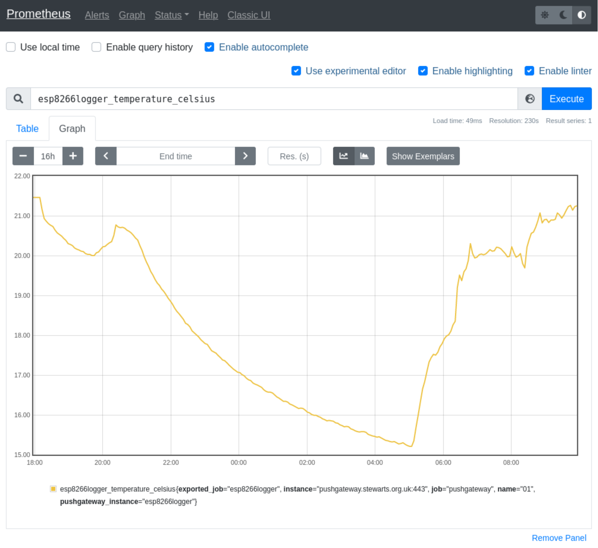
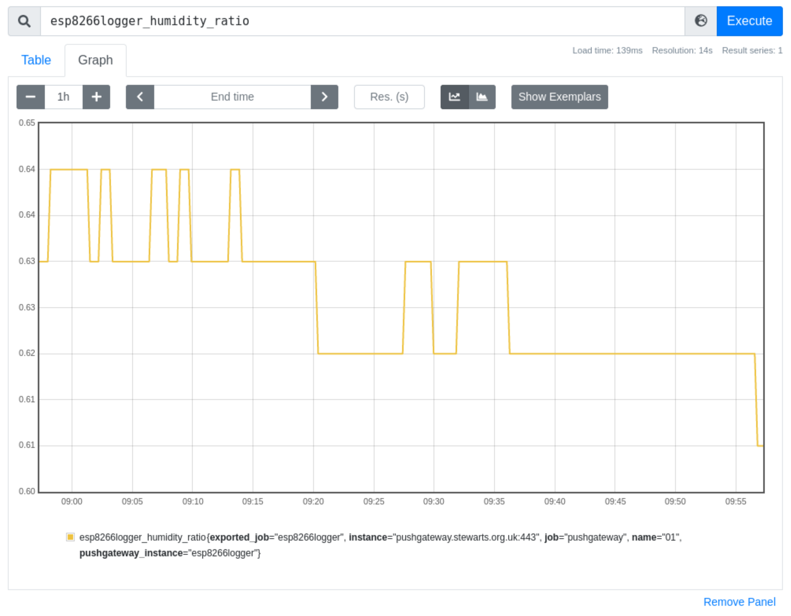

# ESP8266 Logger
## Intro
I wanted to monitor and log temperature over wifi. Usually I would turn to a Raspberry Pi and some 1-wire sensors. However they are not low power enough as I wanted something to run on an external USB battery charger or other battery source. This then led me to look for a microcontroller with wifi, which in turn made me think of something Arduino based to keep things simple. I found out about the ESP8266 from Espressif which is a low-cost Wi-Fi microchip with with built-in microcontroller.

This idea is that a small Arduino sketch would run on an esp8266. It would wake up, read a temperature sensor, and over Wi-Wi send the temperature to a central logging system. In my case this is Prometheus Pushgateway, which acts as a temporary storage which is turn gets polled from Prometheus. Grafana can then render charts based on the Prometheus time series database.

## Hardware
There are many different boards based on the ESP8266. I was not too bothered about which one, apart from one without headers and smallish. In the end without much thought I got a WeMos D1 Mini. Looking at it, its mostly just a ESP8266MOD with a USB chip and another few tiny chips as well as breaking out the GPIO ports to headers. I got a pair of them and some AHT10 Temperature and Humidity Sensors from Amazon for £19.27 in total, which works out at £6.21 per probe.

 * SP-COW 2 Pcs ESP8266 ESP-12F Mini Modules 4M Bytes WLAN WiFi Internet Development Board for Arduino, WeMos ESP8266 Mini https://www.amazon.co.uk/gp/product/B098B23NN9/ £8.99
 * ALAMSCN 6PCS AHT10 Digital Temperature and Humidity Sensor Measurement Module I2C Communication Replace DHT11 SHT20 AM2302 https://www.amazon.co.uk/gp/product/B093PRGXZM/ £10.28

### On 1-Wire
I usually use 1-wire sensors for these type of applications and I found these on Amazon for 75p each:
 * AZDelivery 10 x DS18B20 Digital Temperature Sensor TO92-55°C - +125°C compatible with Arduino and Raspberry Pi, including E-Book! https://www.amazon.co.uk/gp/product/B01LXQF9B5/ £7.49

Initially I connected the 1-wire sensor to one of the GPIO pins in the hope that the normal Arduino OneWire library would work. The actual DS18B20 is a 3 pin package with pin 1: GND, pin 2: Data, pin 3, Vcc. Many examples on the Internet use a pull up resistor (eg 4.7k) on the data line. However after a bit of research I found out that D4 for the ESP8266 has an internal pull up. So in the end I just soldered the 3 pin TO-92 package straight to the board.

References:
 * http://www.esp8266learning.com/wemos-mini-ds18b20-temperature-sensor-example.php
 * https://www.pjrc.com/teensy/td_libs_OneWire.html

The really nice thing about this setup is that you can solder the 3 pin TO-92 package leads straight to the WeMos D1 Mini. This results in a very small setup. For most of the development of the project this was the setup. However once I started pushing data into Prometheus Pushgateway I noticed that the temperature value was always a little high. After quite a bit of reading about 1-Wire sensors and more testing involving pulling my sensors off and running them with short leads and using combinations of running with and without pull-up resistors fed from either the 3v and 5v supplies on the board, I concluded that I probably had a batch of fake DS18B20's and that something in the electronics made them constantly read slightly wrong when soldered directly to the board. My tests were not really conclusive, only that a pull up made a slight difference for the better, but found that even touching a pull up gives the system enough heat that it needs a good deal of time to settle. Once I had the 1-Wire sensor at the end of short wires they seemed to work ok. I then decided that if I'm going to have to resort to fly wires off the board rather than packages soldered straight to the board I may as well use AHT10's which seem to give better data and get humidity as well. Here are a bunch of links I ran into when looking at this:

 * https://platformio.org/lib/show/54/DallasTemperature/examples
 * https://www.letscontrolit.com/forum/viewtopic.php?t=277
 * https://arduino.stackexchange.com/questions/789/my-ds18b20-is-reading-high-how-can-i-get-it-to-return-the-correct-temperature
 * https://github.com/PaulStoffregen/OneWire/issues/91
 * https://github.com/milesburton/Arduino-Temperature-Control-Library/issues/159
 * https://datasheets.maximintegrated.com/en/ds/DS18B20.pdf
 * https://wp.josh.com/2014/06/23/no-external-pull-up-needed-for-ds18b20-temp-sensor/
 * https://hobbycomponents.com/development-boards/864-wemos-d1-mini-pro-esp8266-development-board
 * http://www.esp8266learning.com/wemos-mini-ds18b20-temperature-sensor-example.php
 * https://blog.robertelder.org/ds18b20-raspberry-pi-setup-pullup/

## Build
The AHT10 is a I2C bus chip, which needs GND, Vcc, SDA (serial data line) and SCL (serial clock line). There are connected to GND, 3V3, D2 and D1. I think D1 and D2 are GPIO that work with I2C, I didn't try in other GPIO's and the libraries didn't see to specify a way. AHT10 references:
 * https://crashdown.de/2020/05/01/wemos-d1-mini-on-tasmota-with-aht10-sensor/
 * https://github.com/enjoyneering/AHT10/blob/master/examples/AHT10_Any_MCU_Serial/AHT10_Any_MCU_Serial.ino

I also wanted to be able to use the boards deep sleep functionality. However in order to wake up again, the board needs D0 and RST jumpered together. Deep sleep references:
 * https://diyprojects.io/esp8266-deep-sleep-mode-test-wake-pir-motion-detector/
 * https://randomnerdtutorials.com/esp8266-deep-sleep-with-arduino-ide/
 * https://www.mischianti.org/2019/11/21/wemos-d1-mini-esp8266-the-three-type-of-sleep-mode-to-manage-energy-savings-part-4/

| WeMos D1 Mini pin | AHT10 pin |
| --- | --- |
| 3V3 | VIN |
| G   | GND |
| D1  | SCL |
| D2  | SDA |


## Pictures
Here is the finished device:


## PlatformIO Setup
While I like the Arduino IDE, for some time I've wanted play with PlatformIO and this was the perfect opportunity. The ESP8266 has support: https://docs.platformio.org/en/latest/platforms/espressif8266.html.

There are many ways to install PlatformIO, in the end I chose to create a small script to create a Python venv and install PlatformIO. This makes it quite portable for my setup. Note that I add my account to the dialup group as part of my standard install so that I have the relevant permissions already. This means I don't need to do any udev rules setup. I also didn't want my usual environment messed with.

To setup of build environment looks something like:
```
$ git clone https://github.com/thomasdstewart/esp8266logger.git
$ cd esp8266logger
$ ./installpio.sh
<SNIP>
$ . .venv/bin/activate
```

Afterwards the "pio" command works and you can do a search and see the supported board:
```
$ pio boards  espressif8266 | grep d1_mini
d1_mini            ESP8266  80MHz        4MB      80KB   WeMos D1 R2 and mini
d1_mini_lite       ESP8266  80MHz        1MB      80KB   WeMos D1 mini Lite
d1_mini_pro        ESP8266  80MHz        16MB     80KB   WeMos D1 mini Pro
$
```
(a new blank project can be created with: "pio project init --board d1_mini")

## Build and Deploy
To build the Python venv might need to be loaded with:
```
$ . .venv/bin/activate
$
```

The sketch needs the Wi-Fi and Prometheus Pushgateway URL settings set in the config.h and certs header and example called config-sample.h exists as a template
```
$ cp include/config-sample.h include/config.h
$ vi include/config.h
```

Update the SSID and PASS values for the Wi-Fi Settings and update the LOGGER_NAME is multiple devices are to be used. The setup assumes https to the push gateway without any authantication. However username and password for basic auth can be used by modifying the url in main.cpp.

The following script creates the certs.h with the certificate chain and fingerprints which is needed to use https securly.

```
curl -s https://raw.githubusercontent.com/esp8266/Arduino/master/tools/cert.py | python3 - -s pushgateway.example.org -n pushgateway > include/certs.h
```

To build run "pio run", which looks like:
```
$ pio run
Processing d1_mini (platform: espressif8266; board: d1_mini; framework: arduino)
-------------------------------------------------------------------------------------------------
Verbose mode can be enabled via `-v, --verbose` option
CONFIGURATION: https://docs.platformio.org/page/boards/espressif8266/d1_mini.html
PLATFORM: Espressif 8266 (3.2.0) > WeMos D1 R2 and mini
HARDWARE: ESP8266 80MHz, 80KB RAM, 4MB Flash
PACKAGES: 
 - framework-arduinoespressif8266 3.30002.0 (3.0.2) 
 - tool-esptool 1.413.0 (4.13) 
 - tool-esptoolpy 1.30000.201119 (3.0.0) 
 - toolchain-xtensa 2.100300.210717 (10.3.0)
LDF: Library Dependency Finder -> http://bit.ly/configure-pio-ldf
LDF Modes: Finder ~ chain, Compatibility ~ soft
Found 36 compatible libraries
Scanning dependencies...
Dependency Graph
|-- <OneWire> 2.3.5
|-- <ESP8266HTTPClient> 1.2
|   |-- <ESP8266WiFi> 1.0
|-- <ESP8266WiFi> 1.0
Building in release mode
Retrieving maximum program size .pio/build/d1_mini/firmware.elf
Checking size .pio/build/d1_mini/firmware.elf
Advanced Memory Usage is available via "PlatformIO Home > Project Inspect"
RAM:   [====      ]  35.4% (used 29036 bytes from 81920 bytes)
Flash: [====      ]  37.4% (used 390125 bytes from 1044464 bytes)
================================== [SUCCESS] Took 0.95 seconds ==================================
$
```

To clean the build run: "pio run --target clean". To upload the binary to the board (and build if required) run "pio run --target upload". Any serial console program can then be used to inspect the serial output. If minicom is running and displaying the boards output any upload will fail. I use minicom with this configuration (/etc/minicom/minirc.piusb0):
```
pu port             /dev/ttyUSB0
pu baudrate         115200
pu bits             8
pu parity           N
pu stopbits         1
pu minit            
pu mreset           
pu mhangup          
pu rtscts           No 
pu xonxoff          No 
pu linewrap         Yes
```

With a normal board, it's possible to continually build and upload. However once the D0 and RST are jumpered the automatic method to switch from normal mode to upload mode does not work. The way this is performed it to short D3 and GND with a jumper wire while momentarily pressing the reset switch. After this an upload can be performed. If minicom is running while this is performed the output of the board is displayed and afterwards something like this is output:
```
bpp�$blrl
```

## Run
When running information is sent to the serial port for diagnostic purposes:
```
Woke up
Connecting to: air .....................
Connected with IP: 192.168.1.128
Waiting for NTP time sync: .
Current time: Fri Aug 19 04:22:36 2022
Temperature: 26.03
Humidity: 0.59
URL: https://pushgateway.example.org:443/metrics/job/esp8266logger/
Sending data: 
# TYPE esp8266logger_temperature_celsius gauge
# HELP Temperature in Celsius
esp8266logger_temperature_celsius{name="01"} 26.03
# TYPE esp8266logger_humidity_ratio gauge
# HELP Humidity in percent
esp8266logger_humidity_ratio{name="01"} 0.59

HTTP response code: 200
HTTP response headers: HTTP response payload: 
Deep sleeping
```

Then later you can retrieve that same data from the pushgateway with:
```
$ curl -s https://pushgateway.example.org/metrics | grep ^esp8266logger
esp8266logger_humidity_ratio{instance="",job="esp8266logger",name="01"} 0.59
esp8266logger_temperature_celsius{instance="",job="esp8266logger",name="01"} 26.04

```

# Prometheus Setup
You have to tell Prometheus about the push gateway, eg:

prometheus.yml
```
  - job_name: pushgateway
    scheme: https
    honor_labels: false
    static_configs:
    - targets: ['pushgateway.example.org']
      labels:
        pushgateway_instance: esp8266logger
```

# Prometheus Graph



# Grafana


# MAX6675
I recently wanted to monitor higher temperatures, namely a BBQ while smoking. Neither DS18B20 nor AHT10 are speced for high tempture, so decided to look for a K Type Tehermocouple. I found some for a £5 each including the thermocouple, wires, board and MAX6675 which is an SPI interface.

 * AZDelivery 3 x MAX6675 Temperature Sensor K Type Thermocouple compatible with Arduino and Raspberry Pi including E-Book! https://www.amazon.co.uk/gp/product/B07VKM35ZX/ £14.99

I connected the board to the WeMod D1 as follows:

| WeMos D1 Mini pin | MAX6675 |
| --- | --- |
| G   | GND |
| 5V  | VCC |
| D5  | SCK |
| D6  | CS  |
| D7  | SO  |

The sensor type can be selected in the config.h via defining either USE_AHTXX or USE_MAX6675

